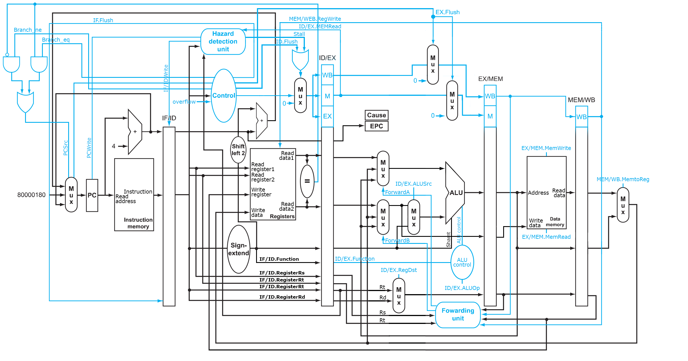
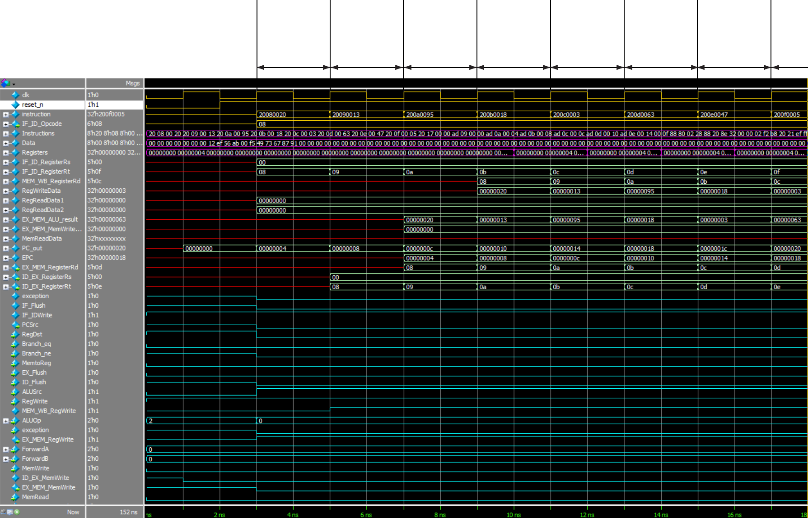
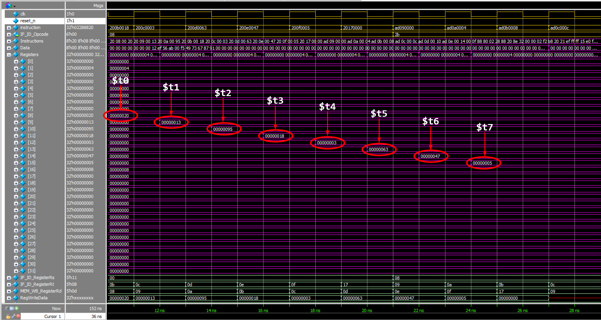
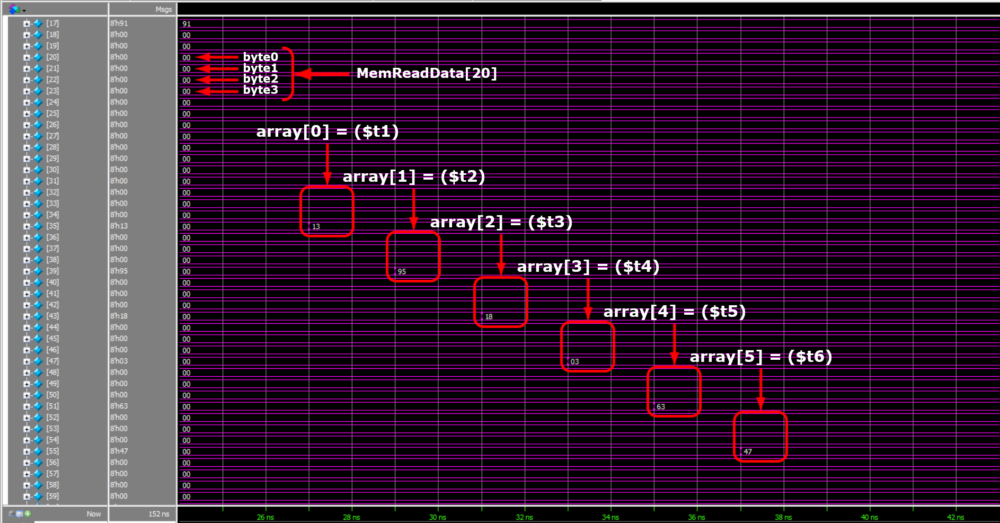
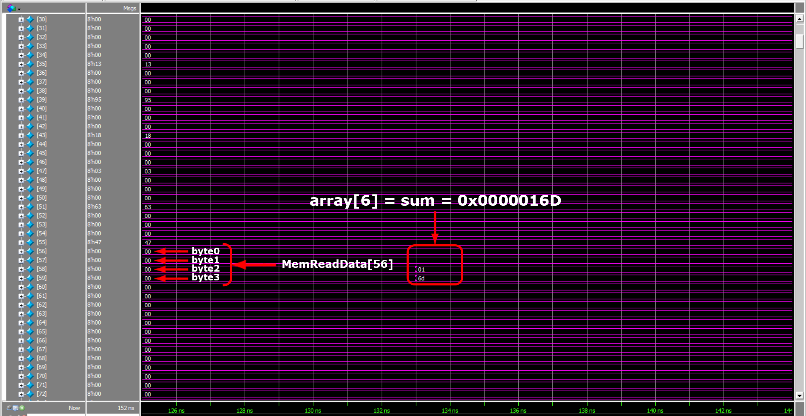

# Pipelined MIPS Processor in SystemVerilog (Verilog)

This repository implements a 32-bit pipelined MIPS architecture using SystemVerilog.

## Architecture


## Structure

* **RTL/**: Source code for the pipelined MIPS processor
    * `MIPS_top.sv`: Top-level module integrating all components
    * `MIPS_datapath.sv`: Datapath for the pipelined MIPS processor
    * `MIPS_control.sv`: Control unit for the pipelined MIPS processor
    * `Main_control.sv`: Main control unit logic
    * `ALUControl.sv`: Decodes ALU operations
    * `Forwarding.sv`: Handles data forwarding between stages
    * `Hazard_detection.sv`: Detects data and control hazards
    * `ALU.sv`: Arithmetic Logic Unit
    * `PC.sv`: Program Counter
    * `InstructionMemory.sv`: Instruction memory model
    * `DataMemory.sv`: Data memory model
    * `RegisterFile.sv`: Register file model
* **Memory_Initialization/**: Initialization files for memories
    * `InstructionMemory.dat`: Initial instruction memory contents
    * `DataMemory.dat`: Initial data memory contents
    * `RegisterFile.dat`: Initial register file contents
* **Verification/**: Testbench, test code and TCL script
    * `MIPS_tb.sv`: Testbench for simulation
    * `test_code.s`: MIPS assembly test code
    * `run_MIPS.do`: TCL script file for ModelSim automation
    * `src_files.list`: List of paths to RTL files to be compiled
* **Documentation/**: Documentation
    * `MIPS_pipelined_documentation.pdf`: Detailed design explanation

## Instruction Handling:

This pipelined MIPS processor supports a variety of instruction formats to provide a comprehensive instruction set:

* **R-Format (Arithmetic):** These instructions perform arithmetic operations on register values, such as add, subtract, and shift operations.
* **Immediate Instructions:**
    * `addi`: Adds a constant value to a register.
* **Load/Store Instructions:**
    * `lw`: Loads data from memory into a register.
    * `sw`: Stores data from a register to memory.
* **Branch Instructions:**
    * `beq`: Branches to a target address if the contents of two registers are equal.
    * `bne`: Branches to a target address if the contents of two registers are not equal.

## Hazard Handling and Exception Support:

This pipelined MIPS processor implements techniques to ensure smooth instruction execution:

* **Forwarding Unit:** This unit identifies data hazards and bypasses the pipeline stages to forward results directly to subsequent stages. This reduces stalls caused by data dependencies.
* **Hazard Detection Unit:** This unit proactively detects control hazards, such as branch instructions. Stalls are strategically inserted to ensure the correct instruction is fetched when a branch is taken.
* **Exception Support:** The processor can handle exceptions like overflow (arithmetic operations exceeding register size) and invalid instructions. These exceptions ensure program integrity and allow for proper error handling routines.

## Simulation Results

###  Flow of instructions through the pipeline:


###  Registers’ contents after the sequence of addi instructions:


###  Initializing the array with contents of the registers:


###  Sum of the array elements (0x13 + 0x95 + 0x18 + 0x3 + 0x63 + 0x47 = 0x16D) is stored in array[6]:


## Getting Started

### Prerequisites

- ModelSim/QuestaSim for simulation
- Quartus Prime for synthesis, place-and-route, and timing analysis

### Running Simulations

1. Clone the repository by typing the following command in your terminal
```bash
git clone https://github.com/amrelbatarny/MIPS_Pipelined_32bit
```
2. Open ModelSim/QuestaSim

3. From the `File` menu, click on `Change directory` and navigate to the `Verification` directory

4. From the `Transcript` window run the following TCL command to run the script file
```tcl
do run_MIPS.do
```


## Further Resources

The included documentation provides a detailed explanation of the design and implementation process (refer to `Documentation` / `MIPS_pipelined_documentation.pdf`).

## Contribution

We welcome contributions to this educational project. Feel free to submit pull requests for improvements or additional features.

## Contact

Click on the image below

<a href="https://beacons.ai/amrelbatarny" target="_blank">
  
</a> 
<br>
